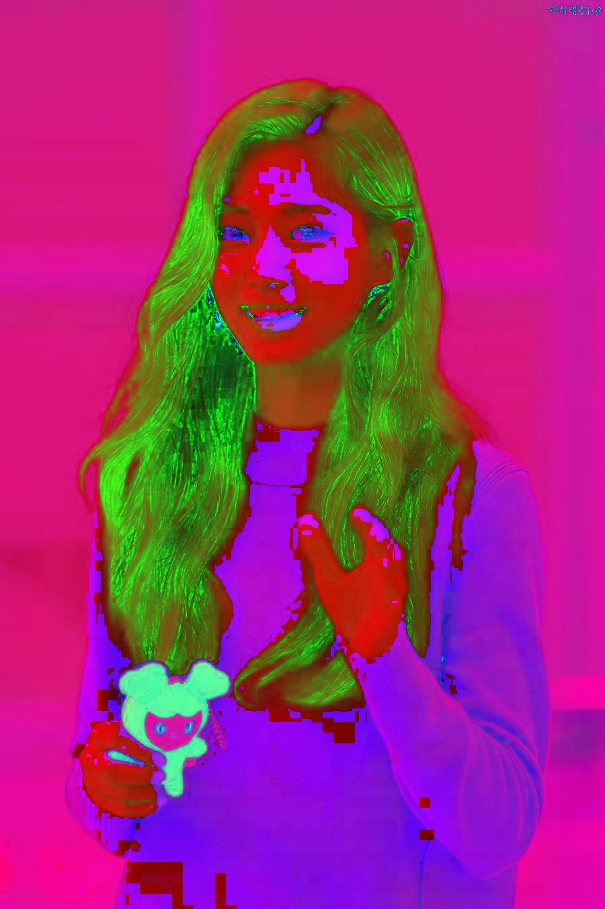
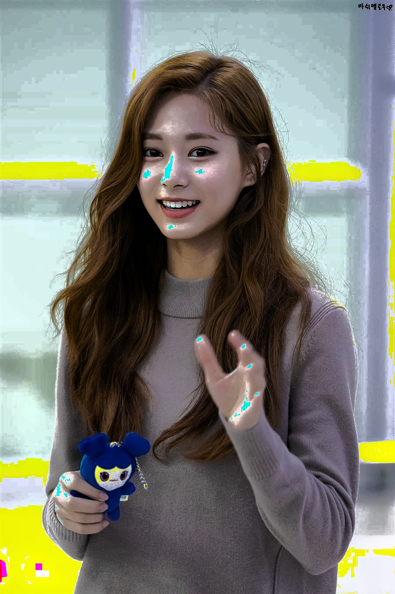

# Implement Histogram Equalization on Intensity of HSI of an image

> AUthor : Ya Chen<br>
> Date : 2021 / 6 / 2

---

<br>
<div>

## Description

Perform contrast enhancements for a color image:<br>
(1) Input a RGB color image;<br>
(2) Scale its RGB pixel values to rgb values, where 0 <= r, g, b <= 1;<br>
(3) Transfer rgb pixel values into hsi values;<br>
(4) Apply the histogram equalization algorithm to the i component to obtain the component;<br>
(5) Transfer the values into values;<br>
(6) Scale values to values, where 0 <= R', G', B' <= 1;<br>
(7) Output the RGB and color images.

</div>
<br>
<br>
<div>

## Execution

Compile main.py to check out this cool thing.<br>
<br>
For Linux OS :

```
>>> make
or
>>> python3 main.py
```

For Windows 10 :

```
>>> python main.py
```

</div>
<br>
<br>
<div>

## In-Output Example

### Input:

&emsp;&emsp; Original Image : Chou-Tzu-yu.jpg<br>
&emsp;&emsp;&emsp;&emsp;&emsp;&emsp;&emsp;&emsp;&emsp;&emsp;


### Output:

&emsp;&emsp; Directly output HSI of an image :<br>
&emsp;&emsp;&emsp;&emsp;&emsp;&emsp;&emsp;&emsp;&emsp;&emsp;


&emsp;&emsp; Histogram-Equalization on Intensity of an image :<br>
&emsp;&emsp;&emsp;&emsp;&emsp;&emsp;&emsp;&emsp;&emsp;&emsp;


</div>
